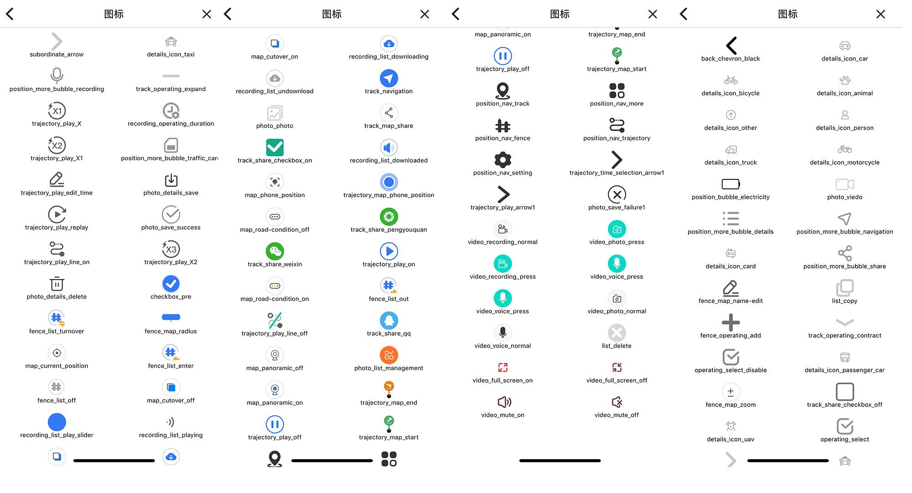

<!--
 * @Descripttion: 
 * @version: 
 * @Author: xieruizhi
 * @Date: 2019-09-24 15:28:09
 * @LastEditors: xieruizhi
 * @LastEditTime: 2019-12-12 10:26:56
 -->

# `Icon` 图标

## Props
| Prop | Type | required | Default | Note |
|---|---|---|---|---|
| [Svg props...](https://github.com/react-native-community/react-native-svg#svg)| 无 | 无 | 无 | 继承svg的所有属性 |
| name | String | true | 无 | 图标名称 |
| color | String | true | 原始颜色 | 图标颜色 |
| size | Number | false | 18 | 图标大小 |

## Demo

```
import React, {Component} from 'react';
import {Circle} from  'react-native-jimi';
const {Icon} =Circle;

export default class IconTest extends Component {
    constructor(props){
        super(props);
    }

    render(){
        return <Icon name='weixinzhifu' size={100} color={'red'} rotation={50}></Icon>;
    }
}

```


## Icon
