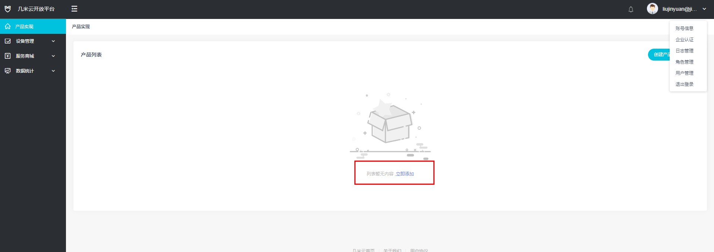
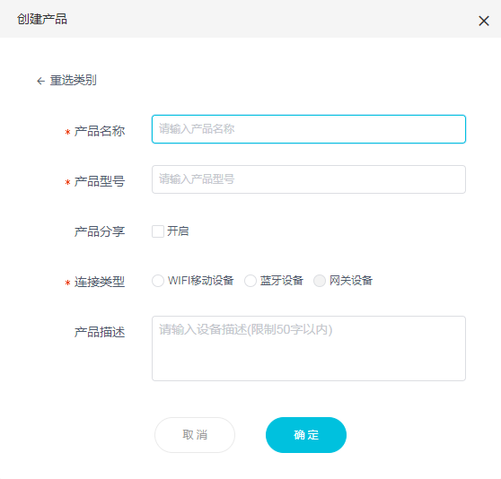
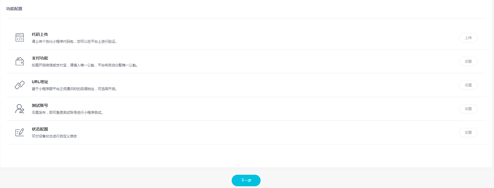
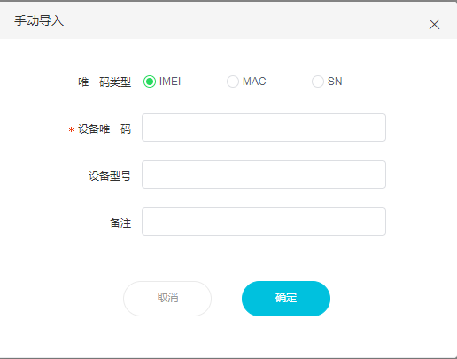

# 小程序组件快速构建项目

## 创建
1. 安装
    - node 安装最新稳定版本即可。
    - Python2 Python 的版本必须为 2.x（不支持 3.x）。
    - [JDK下载地址](https://www.oracle.com/technetwork/java/javase/downloads/jdk8-downloads-2133151.html) JDK 的版本必须是 1.8（目前不支持 1.9 及更高版本）。
    - 几米圈APP [几米圈APP下载地址](https://fir.im/jimiCircle)，该版本是debug版本，用于开发调试。
    - yarn 最新稳定版本。 
    
	    ```
	    npm install yarn -g
	    ```
    - jimi-cil 几米圈小程序快速构建工具。
    
	    ```
	    npm install jimi-cil -g
	    ```
2. 快速创建模板小程序

	```
	jimi init projectName
	```

3. 启动

	```
	cd projectName
	```

	```
	yarn
	```

	```
	yarn start
	``` 

这样，一个基本的程序就已经搭建完毕，我们可以进入几米圈APP查看和调试。

## 调试
#### ios
 - 连续点击左上角几米圈文字十次及以上进入设置本地环境IP地址（可通过cmd命令ipconfig查看）。
 - 进入菜单<b>我的</b>中点击<em>体验中心</em> 进入到当前启动的小程序。（手机网络需和电脑网络处于同一个网段）
 - 摇一摇开启Debug模式，选择<em>Debug JS Remotely</em> 可在浏览器控制台查看小程序log。

 - [ios调试视频](./image/RPReplay_Final1577950612.mp4)

 <video src="./image/RPReplay_Final1577950612.mp4" controls="controls" width="640" height="360">您的浏览器不支持播放该视频！</video>

#### android
 - 用数据线将测试机和电脑连接，选择文件传输模式，并在小程序控制台输入adb reverse tcp:8081 tcp:8081,进行IP代理。
 - 点击顶部文字进入修改环境，选择<em>国内正式环境</em> 、<em>RN直调</em> ，点击保存。
 - 进入菜单<b>我的</b>中点击<em>体验中心</em> ,输入appID（随意）和imei进入小程序。
 - 摇一摇开启Debug模式，选择<em>Debug JS Remotely</em> 可在浏览器控制台查看小程序log。
 
 - [android调试视频](./image/20200102141327.mp4)
 
 <video src="./image/20200102141327.mp4" controls="controls" width="640" height="360">您的浏览器不支持播放该视频！</video>

## 开发

1. 标准小程序组件[react-native-jimi](react-native-jimi)
```
使用jimi-cli命令构建的小程序项目已经配置好一个基础的模板，这些模板并不是固定的，它可以通过配置和少量的代码进行修改。
```
2. 定制化开发[react-native@0.5.8](https://reactnative.cn/docs/0.58/getting-started.html)
```
定制化开发需要掌握一定web编程基础，及认识react-native。几米圈底层由react-native构建，小程序组件也是基于react-native开发，所以大可以放心使用react-tive@0.58.6该版本所有组件和API。
```
3. APP通讯接口[几米圈APP接口](http://apidoc.jimimax.com/doc/2QHqHXTaMd)
```
除了使用标准小程序组件中已经封装好的接口，也可以直接与APP通讯。
```
4. 定制化接口
```
几米圈允许用户自定义第三方sass及双方服务端共用，几米圈拥有返回用户token的接口，方便作为小程序的唯一标识。
```
5. APP相关配置
```
在小程序项目中，我们在加载入口拥有entrance.json配置，内容解释如下。
```

| 参数  | 说明 | 默认值 | 版本 |
|:-------|:-------|:-------|:-------|
| deviceName <font color=red >*****</font>  | 小程序名称 | - |  2.0.3 |
| versions <font color=red >*****</font> | 小程序内部版本号，改版本号建议和平台创建小程序版本时的版本号保持一致 | - | 2.0.3 |
| deviceType   | 小程序设备类型   | - |  2.0.3 |
| launch_path   <font color=red >*****</font>  | 小程序首次打开文件 | - |  2.0.3 |
| engineMode <font color=red >*****</font>      | 小程序引擎类型，"1"为RN "0"为web | - |  2.0.4 |
| reactNativeModuleName<font color=red >*****</font>   | RN模块名，当使用RN框架时必传  | - |  2.0.4 |
| navigationStyle      | 导航条状态，传default为默认显示导航条  传custom为自定义导航条将不会展示原生导航条 | custom |  2.0.3 |
| navigationBarBackgroundColor    | 小程序导航条背景颜色  | #FFFFFF |  2.0.3 |
| navigationBarTextStyle     | 导航条按钮与状态栏文字颜色 black为黑,white为白  | black |  2.0.3 |
| navigationBarTitleText     | 当显示原生导航条时展示title  | - |  2.0.3 |


## 打包

#### ios
```
yarn ios
```
#### android
```
yarn android
```
打包完毕之后就可以上传到几米云开放平台。


## 认识几米云开放平台
[国内几米云开放平台网址](http://cloud.jimimax.com/#/login)

[国际几米云开放平台网址](http://cloud.eu-central-1.jimimax.com/#/login)
#### 序言
```
几米云开放平台是基于几米圈小程序开发者搭建的一个控制管理平台，其中包括但不限于用户管理、设备导入、小程序控制、日志查询、数据统计等功能。方便开发者对小程序和产品的日常管控和迭代。所以在开发小程序之前，我们必须掌握如何在几米云开放平台中控制自己的小程序。
```
#### 创建产品

1. 注册登录，通过邮箱注册登录之后拥有小程序开放平台功能使用权限。
2. 几米云开放平台大致如左侧和右侧菜单，创建小程序之前我们第一步是创建一个产品。
	
    
22222132
3. 创建产品需注意：
    - <em>产品名</em> 会是用户首次添加设备时所见小程序的名字。
    - <em>分享</em> 开启该分享可以通过几米圈APP分享给其他用户使用，该分享不可关闭（注意产品隐私）。

	

4. 点击进入产品创建第一个小程序版本，我们在进入下一步之后可以进行小程序代码包上传以及一些相关配置。值得注意的是在国际版上传小程序过程中，因为跨国服务器的问题可能存在一定的延迟（创建小程序版本之前需先开发小程序）。
    - <em>测试账号</em> 可以让测试在未进行发布的情况下进行小程序功能的测试。

	

5. 上传完代码包之后，就可以申请审核发布，我们工作人员会在第一时间对小程序进行审核，还请提供具有真实数据设备的小程序账号。若审核不及时可以发送邮件至liujinyuan@jimilab.com进行处理。

#### 设备导入
1. <em>机型</em> 是当该小程序支持多款设备且设备间存在差异的过程中拥有的识别码，可通过机型进行不同的功能调整。

	

#### 使用设备
设备导入之后，用户可以通过APP首页的+号进行添加设备，进入到小程序当中。注意：若小程序该版本没有通过审核，只有测试账号能够进入哦。正常用户只会加载已经通过审核的版本。

## 完全定制化开发
```
几米圈APP支持完全定制化开发，并支持react-native和H5两个版本，但两者之间存在差异，详情查看小程序开发文档。

```
